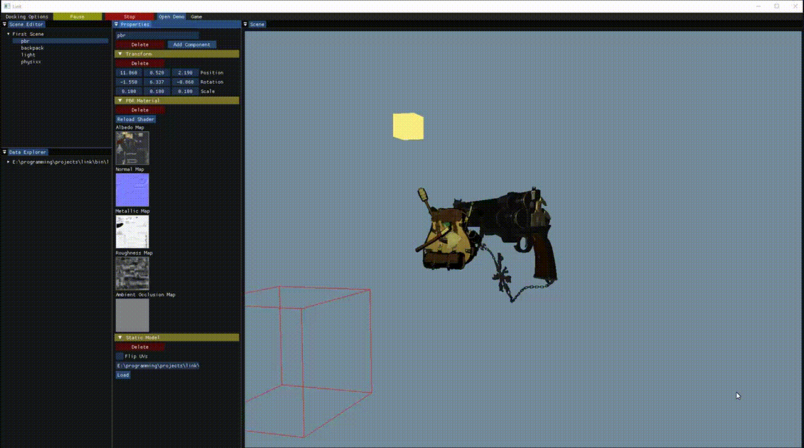

# Link Engine

Toy game engine capable of:
  - Loading, compiling and runnning shaders (Bling-phong, PBR)
  - Loading and showing models
  - Basic scene managment (component based)
  - Basic light system
  - Started integrating Bullet for physics

Uses IMGUI for the editor. Can be run in editor or game mode.

